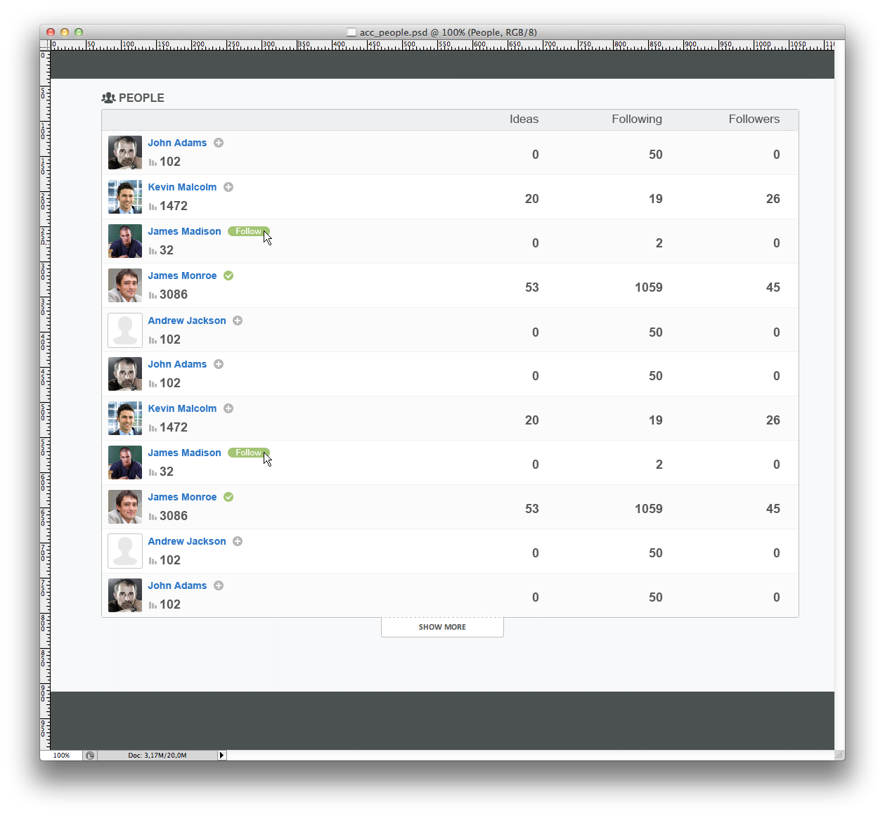

# People-HTML-CSS-JS-test

Выполненный тест по верстке веб-страниц с ипользованием JavaScript.

Задача была сверстать веб-страницу на основе предоставленного изображения [people.png](https://raw.githubusercontent.com/OsmakRoman/People-HTML-CSS-JS-test/master/people.png).

Также рядом с именем в каждой строке необходимо было с помощью JavaScript реализовать кнопку Follow/Unfollow.

HTML версия на Github Pages [тут](https://osmakroman.github.io/People-HTML-CSS-JS-test/).

#

#
